# Catfecito: Full-Stack E-commerce 

Welcome to the technical demo of **Catfecito**, a complete e-commerce platform built from scratch with **React, Node.js, and PostgreSQL**.

## Table of Contents

1. [Project Overview & Tech Stack](#1-project-overview--tech-stack)
2. [Smart Catalog & Filtering](#2-smart-catalog--filtering)
3. [Secure Cart & Checkout Flow](#3-secure-cart--checkout-flow)
4. [Powerful Admin Dashboard](#4-powerful-admin-dashboard)
5. [Order Management & Automation with n8n and webhook](#5-order-management--automation)
6. [Security & Authentication](#6-security--authentication)

---

---

### 1. Project Overview & Tech Stack
A robust, scalable solution designed for real-world performance.

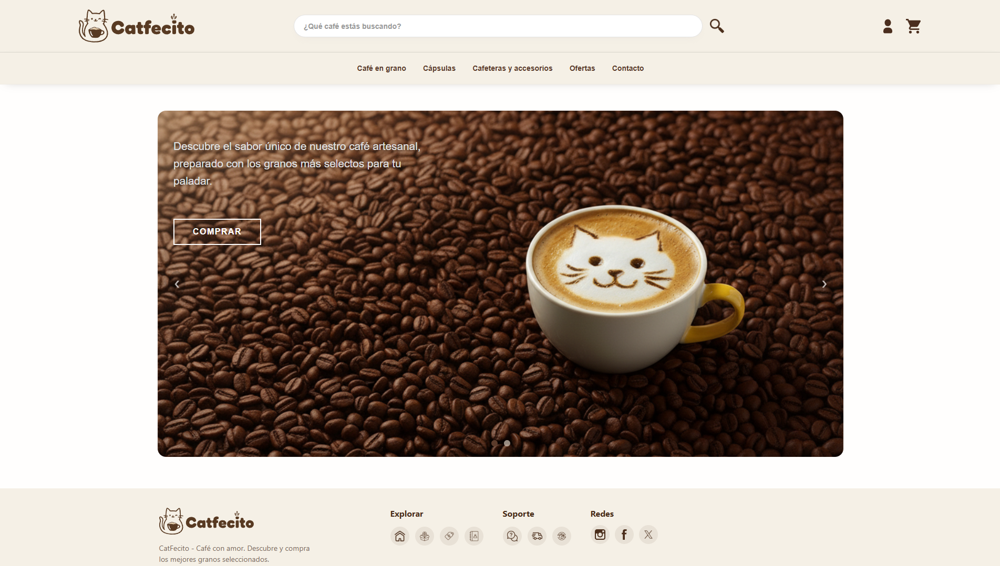

  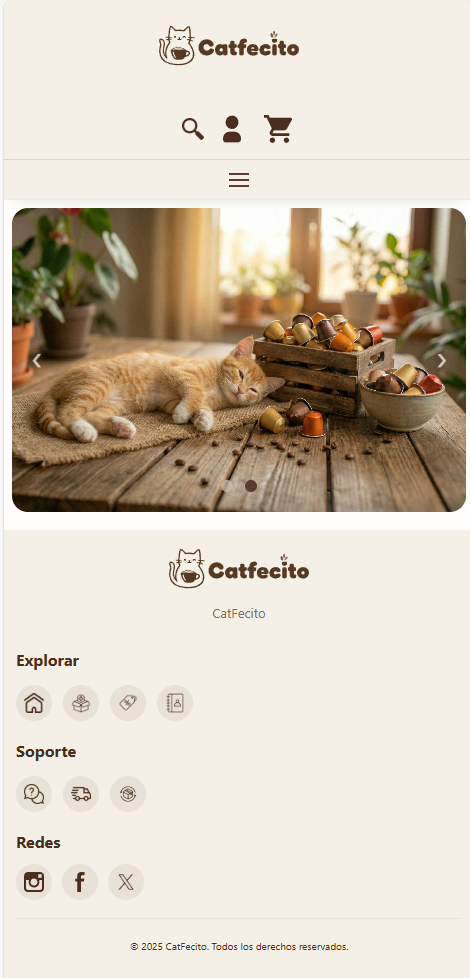

### 2. Smart Catalog & Filtering
Features live search, dynamic filtering by categories/price, and a fully responsive design for all devices.

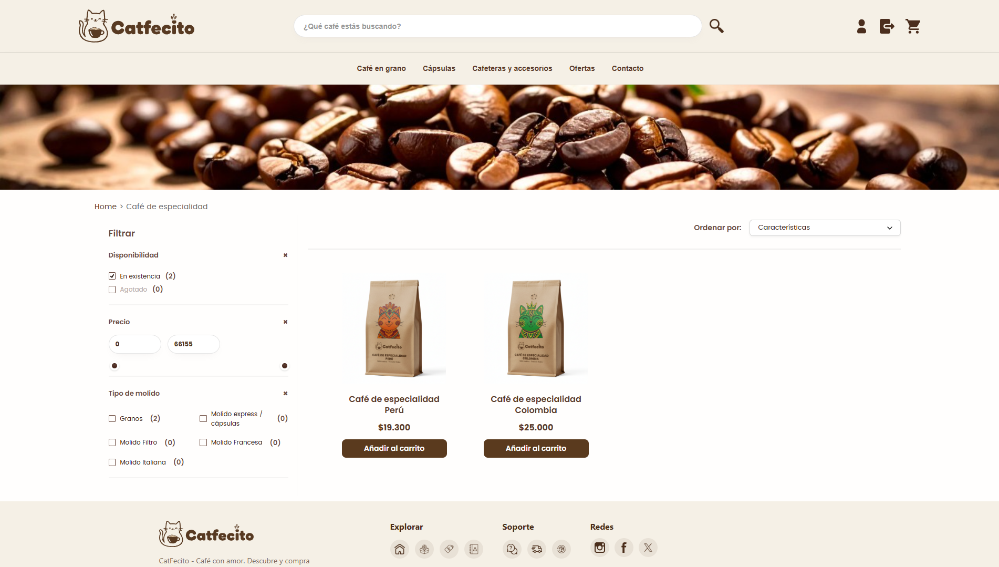

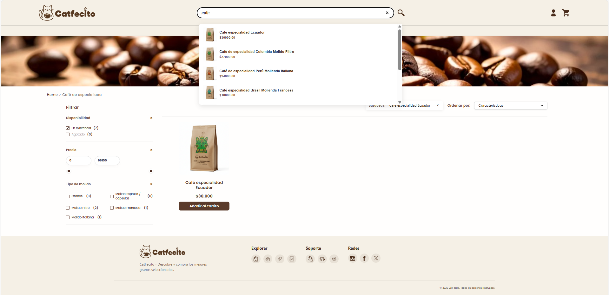

  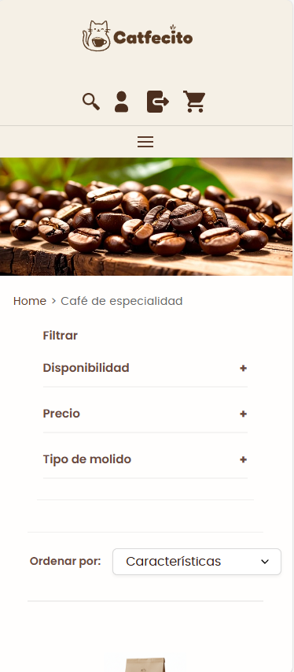

### 3. Secure Cart & Checkout Flow

Persistent shopping cart integration and a secure checkout process protected by user authentication.

  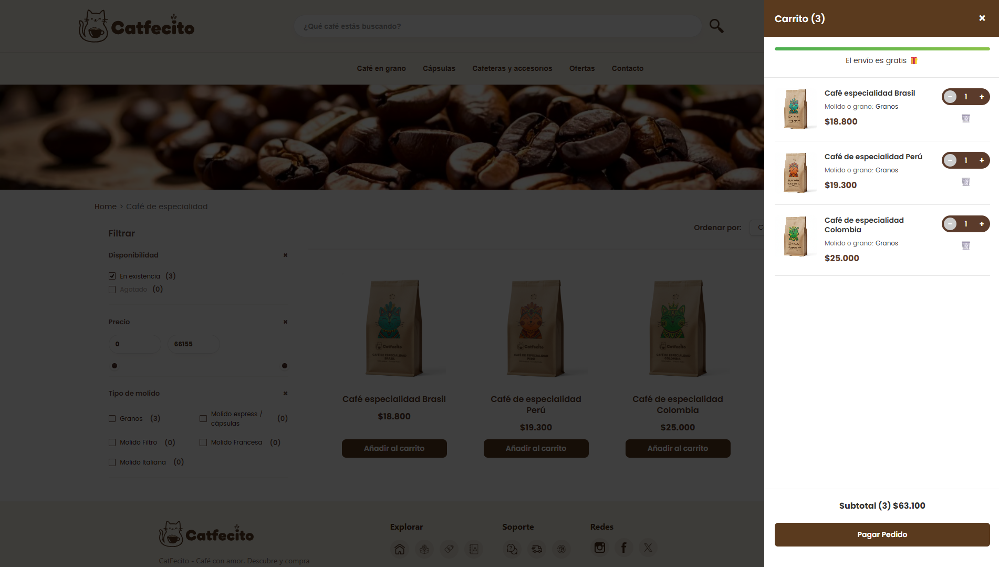

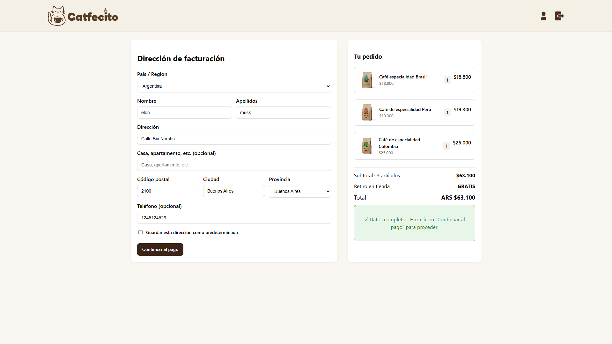

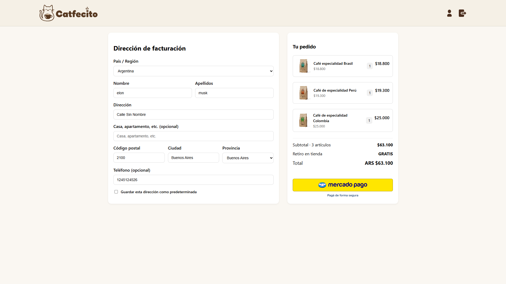

### 4. Powerful Admin Dashboard
Complete control for the business owner. Real-time CRUD for products, stock management, and image uploads.

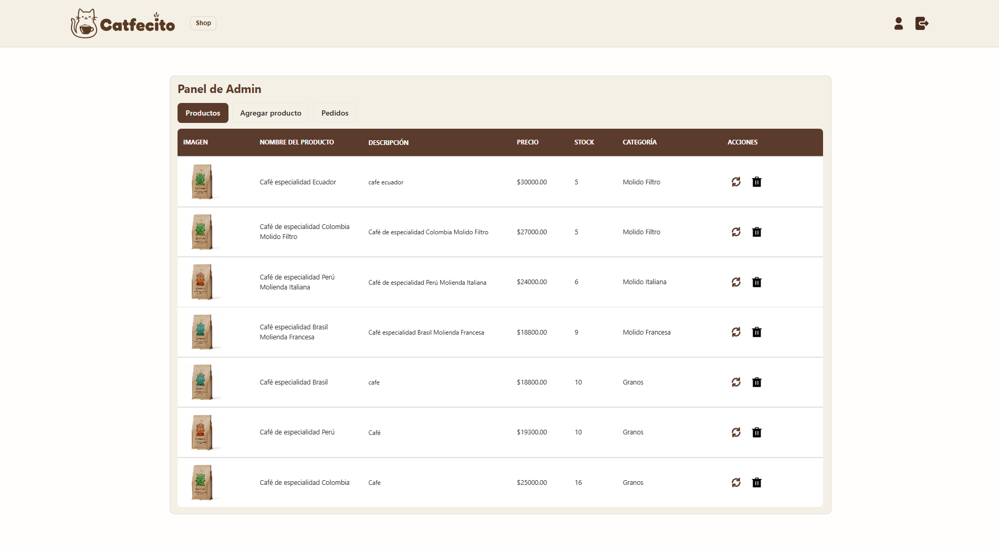

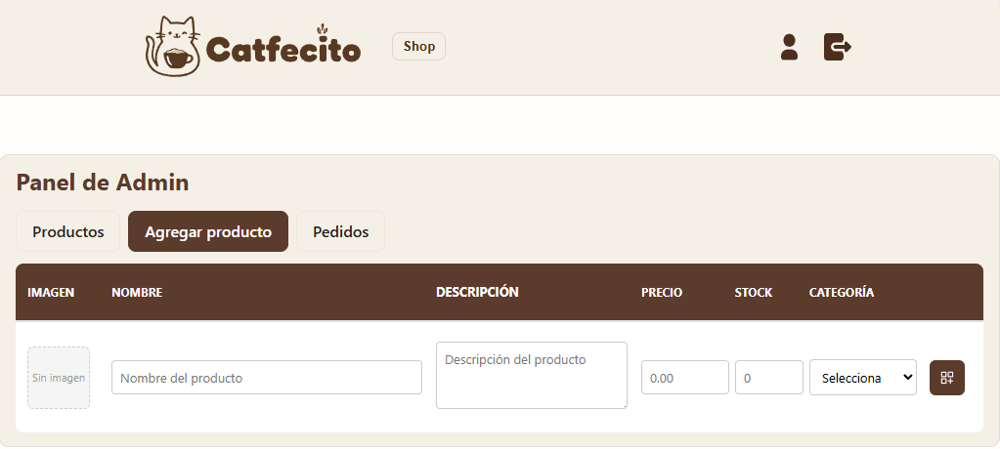

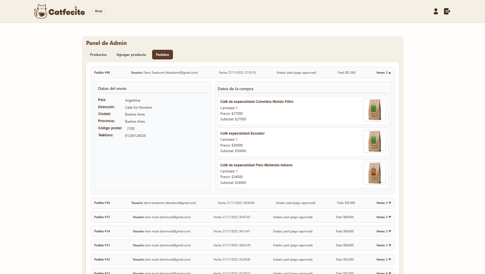

### 5. Order Management & Automation

The system handles orders automatically. When a payment is approved, webhooks trigger n8n workflows to update the database and notify the user.

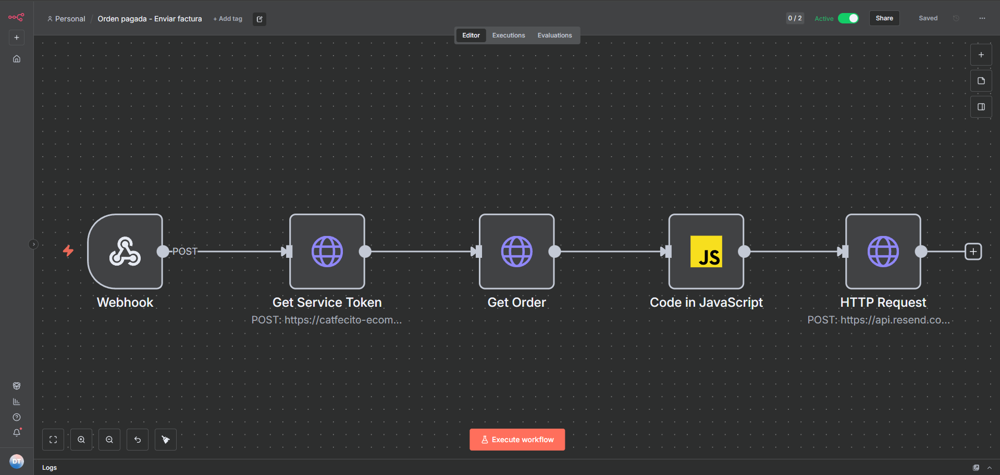

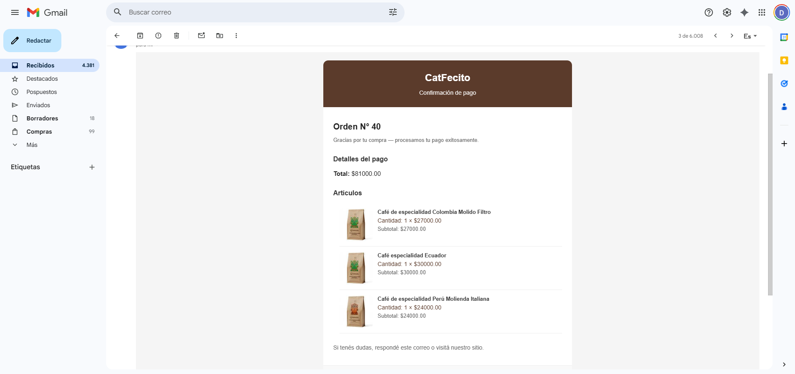

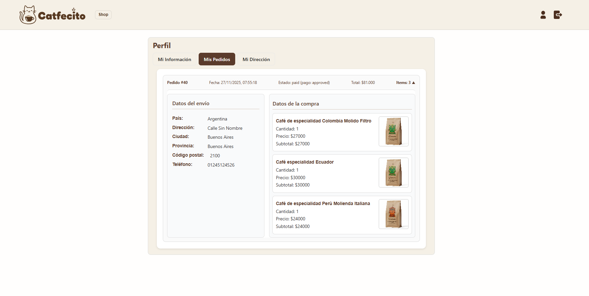

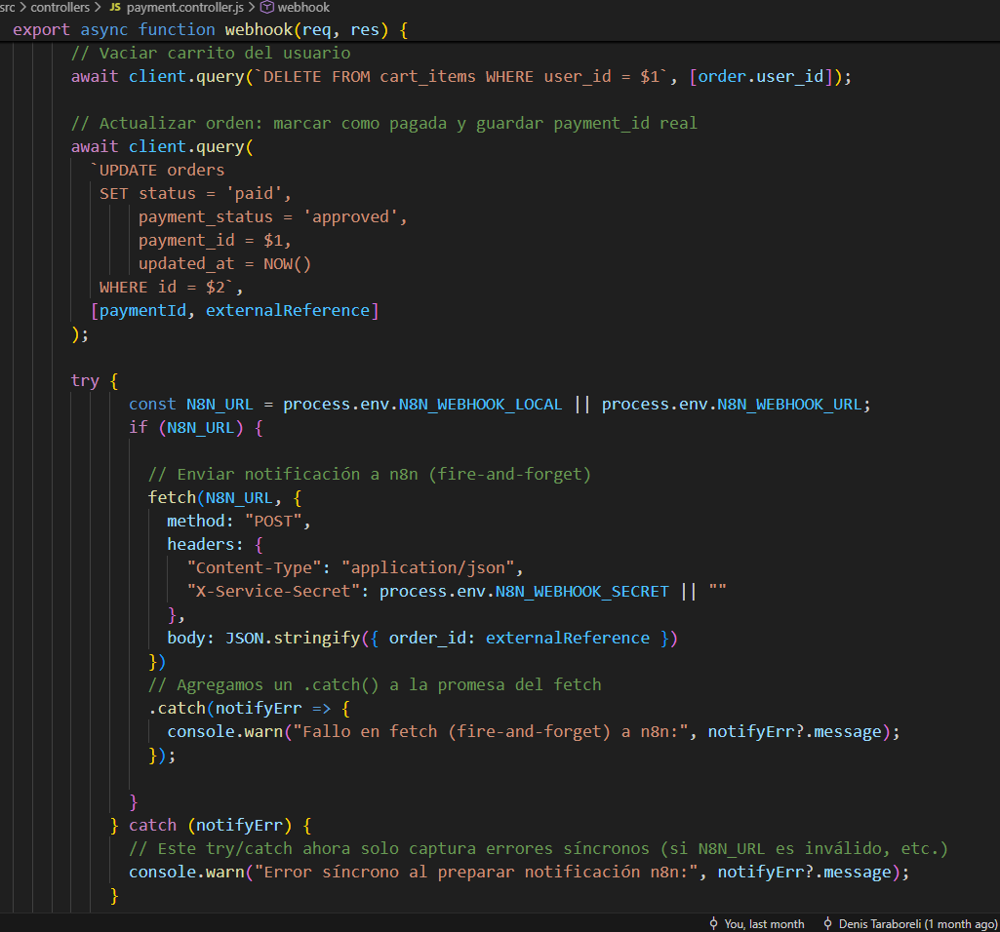

### 6. Security & Authentication

User data is protected with JWT Authentication. Includes an automated password recovery flow via email.

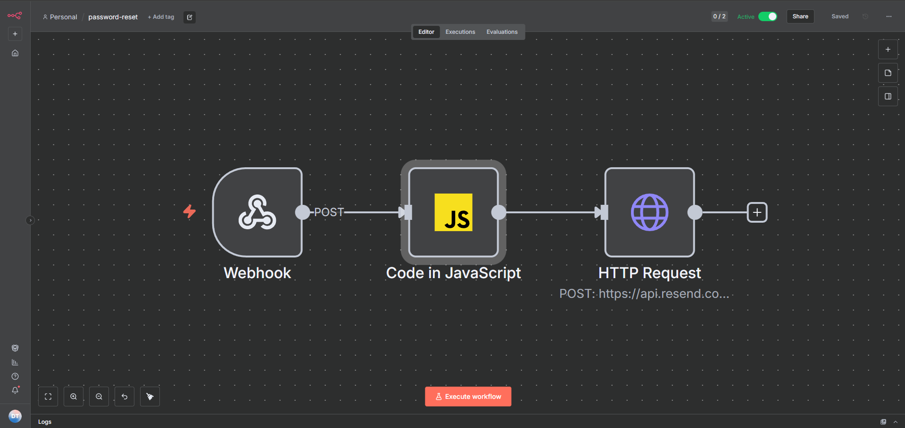

  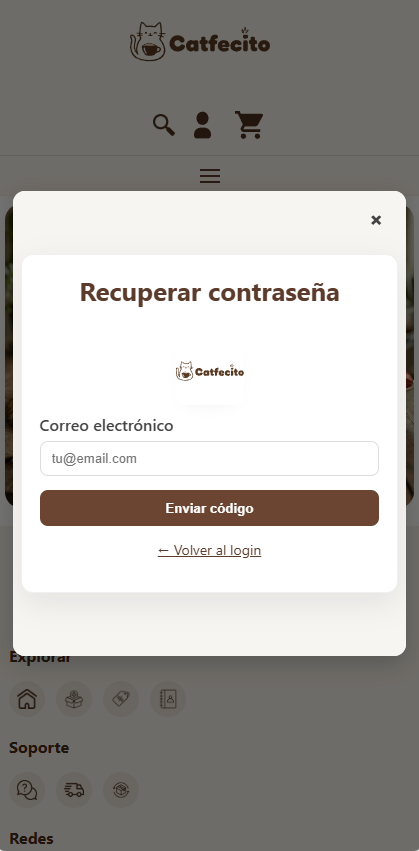

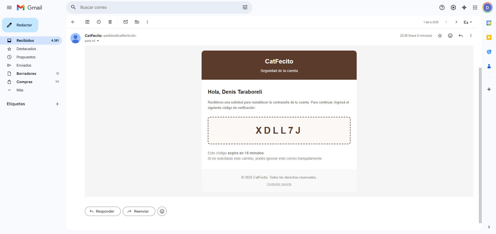

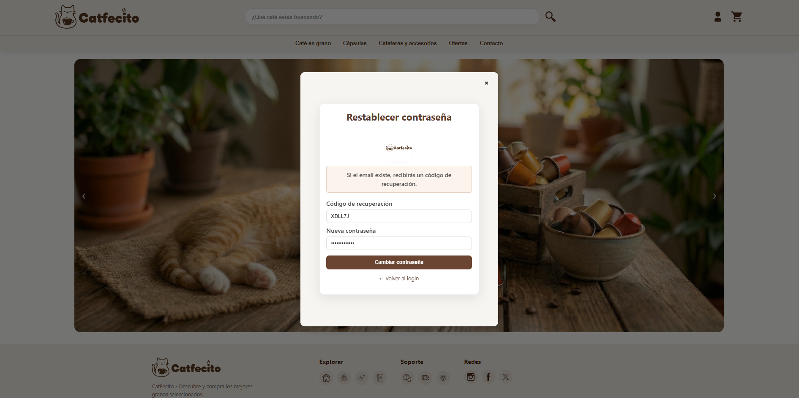